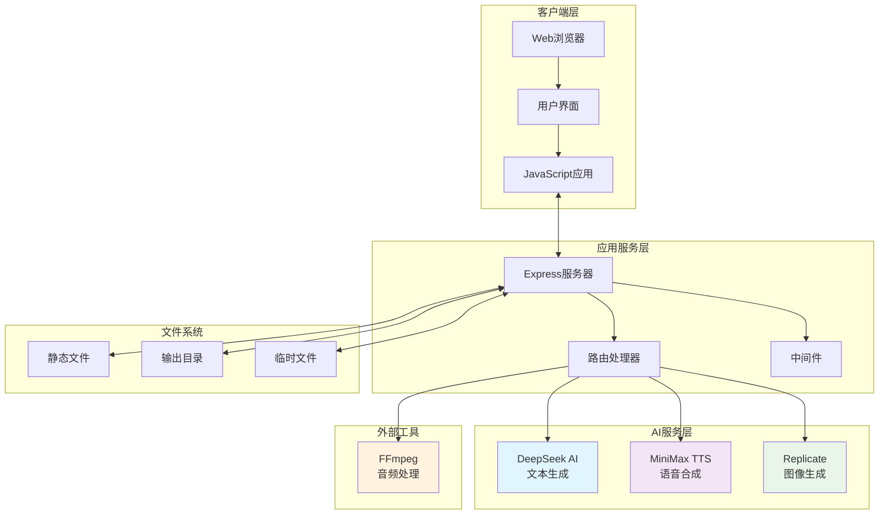
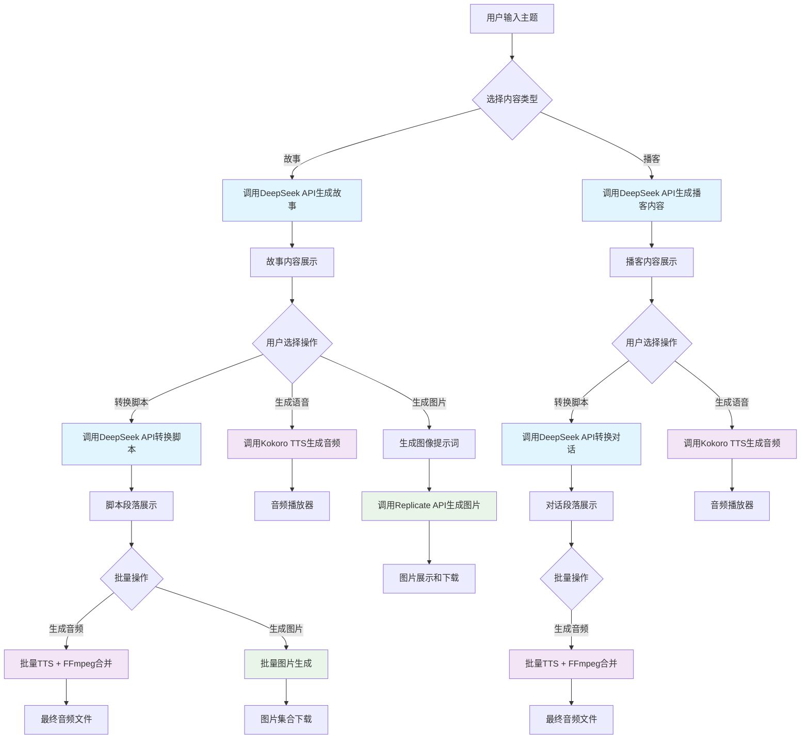
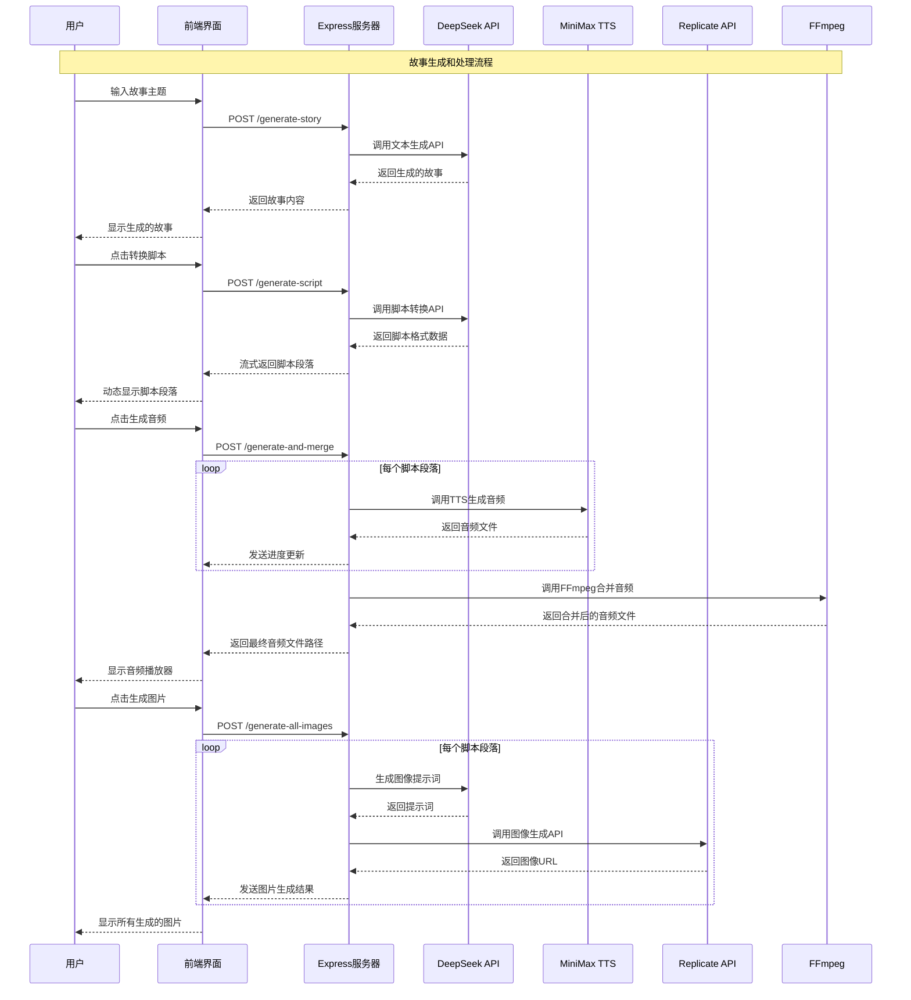

# AI ContentCraft 技术文档

## 目录
- [项目概述](#项目概述)
- [系统架构](#系统架构)
- [安装和配置](#安装和配置)
- [API文档](#api文档)
- [核心模块说明](#核心模块说明)
- [数据流程](#数据流程)
- [部署指南](#部署指南)
- [开发指南](#开发指南)
- [故障排除](#故障排除)
- [版本历史](#版本历史)

## 项目概述

### 项目目的
AI ContentCraft 是一个多功能的内容创作工具，旨在通过集成多种AI服务来简化内容创作流程。该项目帮助创作者快速生成故事、播客脚本和配套的音视频内容，大大提高内容创作效率。

### 主要功能
- **🎯 故事生成**：基于主题自动生成短篇故事
- **📝 脚本转换**：将故事转换为标准剧本格式
- **🎙️ 播客内容**：生成播客大纲和对话脚本
- **🗣️ 语音合成**：支持多种声音的文本转语音
- **🎨 图像生成**：为故事场景生成配图
- **🌐 双语支持**：支持内容的中英文转换
- **📊 批量处理**：支持批量生成和下载内容

### 技术栈

#### 前端技术
- **HTML5/CSS3**：现代化的用户界面
- **JavaScript (ES6+)**：交互逻辑和API调用
- **响应式设计**：适配不同设备屏幕

#### 后端技术
- **Node.js**：服务器运行环境
- **Express.js**：Web应用框架
- **ES Modules**：现代化的模块系统

#### AI服务集成
- **DeepSeek AI**：文本生成服务
- **MiniMax Speech-02-Turbo**：语音合成服务（通过Replicate API）
- **Replicate**：图像生成服务

#### 工具和依赖
- **FFmpeg**：音频处理和合并
- **dotenv**：环境变量管理
- **nodemon**：开发环境热重载

## 系统架构

### 整体架构设计



### 架构特点

#### 前后端分离
- **前端**：纯静态HTML/CSS/JavaScript，负责用户交互和界面展示
- **后端**：Node.js + Express RESTful API，处理业务逻辑和AI服务调用
- **通信**：基于HTTP/HTTPS的JSON API通信

#### 微服务集成
- **松耦合设计**：各AI服务独立集成，便于维护和扩展
- **错误隔离**：单个服务故障不影响其他功能
- **可扩展性**：易于添加新的AI服务或功能模块

#### 文件管理
- **静态资源**：HTML、CSS、JS文件直接服务
- **动态内容**：生成的音频、图片文件存储在output目录
- **临时文件**：音频处理过程中的临时文件自动清理

## 安装和配置

### 环境要求

#### 系统要求
- **操作系统**：Windows 10+、macOS 10.15+、Ubuntu 18.04+
- **Node.js**：版本 16.0 或更高
- **内存**：建议 4GB 以上
- **存储空间**：至少 2GB 可用空间

#### 必需软件
- **Node.js 和 npm**：JavaScript运行环境和包管理器
- **FFmpeg**：音频处理工具
- **Git**：版本控制工具（用于克隆项目）

### 安装步骤

#### 1. 克隆项目
```bash
git clone https://github.com/nicekate/AI-ContentCraft.git
cd AI-ContentCraft
```

#### 2. 安装依赖
```bash
# 安装项目依赖
npm install

# 或者手动安装各个依赖
npm install dotenv express kokoro-js openai replicate

# 安装开发依赖
npm install -D nodemon
```

#### 3. 配置环境变量
创建 `.env` 文件并添加以下配置：
```bash
# DeepSeek AI API密钥
DEEPSEEK_API_KEY=your_deepseek_api_key_here

# Replicate API令牌
REPLICATE_API_TOKEN=your_replicate_token_here
```

#### 4. 安装和配置FFmpeg

**macOS (使用Homebrew):**
```bash
brew install ffmpeg
```

**Ubuntu/Debian:**
```bash
sudo apt update
sudo apt install ffmpeg
```

**Windows:**
1. 从 [FFmpeg官网](https://ffmpeg.org/download.html) 下载
2. 解压到合适目录
3. 将FFmpeg路径添加到系统PATH

#### 5. 更新FFmpeg路径
在 `server.js` 文件中更新FFmpeg路径：
```javascript
// 根据你的系统更新路径
const ffmpegPath = '/usr/local/bin/ffmpeg';  // macOS
// const ffmpegPath = '/usr/bin/ffmpeg';     // Linux
// const ffmpegPath = 'C:\\ffmpeg\\bin\\ffmpeg.exe';  // Windows
```

### 配置说明

#### API密钥获取

**DeepSeek AI:**
1. 访问 [DeepSeek平台](https://platform.deepseek.com/)
2. 注册账号并登录
3. 在API密钥页面创建新的密钥
4. 复制密钥到 `.env` 文件

**Replicate:**
1. 访问 [Replicate官网](https://replicate.com/)
2. 注册账号并登录
3. 在账户设置中找到API令牌
4. 复制令牌到 `.env` 文件

#### 端口配置
默认端口为3000，如需修改可在 `server.js` 中更改：
```javascript
const port = 3000; // 修改为你需要的端口
```

### 启动应用

#### 开发模式
```bash
npm run dev
```
使用nodemon启动，支持热重载

#### 生产模式
```bash
npm start
```
直接使用node启动

#### 访问应用
打开浏览器访问：`http://localhost:3000`

## API文档

### 接口概览

| 接口路径 | 方法 | 功能描述 |
|---------|------|----------|
| `/voices` | GET | 获取可用语音列表 |
| `/generate-story` | POST | 生成故事内容 |
| `/generate-script` | POST | 转换故事为脚本 |
| `/generate-podcast` | POST | 生成播客内容 |
| `/generate-podcast-script` | POST | 转换播客脚本 |
| `/generate` | POST | 单段文本转语音 |
| `/generate-and-merge` | POST | 多段文本转语音并合并 |
| `/generate-image-prompt` | POST | 生成图像提示词 |
| `/generate-image` | POST | 生成图像 |
| `/generate-all-images` | POST | 批量生成图像 |
| `/download-images` | POST | 下载图像 |
| `/translate-podcast` | POST | 翻译播客脚本 |
| `/translate-story-script` | POST | 翻译故事脚本 |

### 详细接口说明

#### 1. 获取语音列表
```http
GET /voices
```

**响应示例：**
```json
[
  {
    "id": "af_nicole",
    "name": "Nicole",
    "language": "en-us",
    "gender": "Female"
  },
  {
    "id": "am_michael",
    "name": "Michael",
    "language": "en-us",
    "gender": "Male"
  }
]
```

#### 2. 生成故事
```http
POST /generate-story
Content-Type: application/json

{
  "theme": "一个关于友谊的温暖故事"
}
```

**响应示例：**
```json
{
  "success": true,
  "story": "在一个小镇上，住着两个截然不同的孩子..."
}
```

#### 3. 转换脚本
```http
POST /generate-script
Content-Type: application/json

{
  "story": "完整的故事文本内容..."
}
```

**响应示例（流式响应）：**
```json
{"type": "status", "message": "Converting story to script..."}
{"type": "complete", "success": true, "script": {"scenes": [...]}}
```

#### 4. 文本转语音
```http
POST /generate
Content-Type: application/json

{
  "text": "Hello, this is a test message.",
  "voice": "af_nicole"
}
```

**响应示例：**
```json
{
  "success": true,
  "audioData": "base64编码的音频数据"
}
```

#### 5. 批量音频生成和合并
```http
POST /generate-and-merge
Content-Type: application/json

{
  "sections": [
    {
      "text": "第一段文本",
      "voice": "af_nicole"
    },
    {
      "text": "第二段文本",
      "voice": "am_michael"
    }
  ]
}
```

**响应示例（流式响应）：**
```json
{"type": "progress", "current": 1, "total": 2, "message": "Generating audio for section 1/2"}
{"type": "complete", "success": true, "filename": "output/2025-01-20T10-30-00-000Z/audio.wav"}
```

#### 6. 生成图像
```http
POST /generate-image
Content-Type: application/json

{
  "prompt": "A beautiful sunset over mountains",
  "sectionId": "section-123",
  "seed": 1234
}
```

**响应示例：**
```json
{
  "success": true,
  "imageUrl": "https://replicate.delivery/pbxt/...",
  "sectionId": "section-123"
}
```

### 错误处理

所有API接口都遵循统一的错误响应格式：

```json
{
  "success": false,
  "error": "具体的错误信息"
}
```

**常见错误码：**
- `400 Bad Request`：请求参数错误
- `500 Internal Server Error`：服务器内部错误
- `503 Service Unavailable`：AI服务不可用

## 核心模块说明

### 1. 故事生成模块

#### 功能概述
故事生成模块是系统的核心功能之一，通过DeepSeek AI API根据用户输入的主题自动生成短篇故事。

#### 实现原理
```javascript
// 故事生成核心逻辑
app.post('/generate-story', async (req, res) => {
    const { theme } = req.body;
    try {
        const response = await openai.chat.completions.create({
            model: 'deepseek-chat',
            messages: [
                {
                    role: 'system',
                    content: 'You are a professional story writer. Create engaging and interesting short stories with good plot development.'
                },
                {
                    role: 'user',
                    content: `Write a short story about "${theme}" in around 200 words`
                }
            ],
        });

        res.json({
            success: true,
            story: response.choices[0].message.content
        });
    } catch (error) {
        res.status(500).json({
            success: false,
            error: error.message
        });
    }
});
```

#### 特性
- **智能主题理解**：能够理解复杂的主题描述
- **情节发展**：生成具有完整情节结构的故事
- **长度控制**：默认生成约200字的短篇故事
- **多语言支持**：支持中英文主题输入

### 2. 语音合成模块

#### 功能概述
语音合成模块使用MiniMax Speech-02-Turbo技术，通过Replicate API调用，支持多种声音类型和情感表达，能够将文本转换为自然流畅的语音。

#### 技术实现
```javascript
// MiniMax TTS 辅助函数
async function generateSpeechWithMiniMax(text, voiceId = "Wise_Woman") {
    const output = await replicate.run(
        "minimax/speech-02-turbo",
        {
            input: {
                text: text,
                voice_id: voiceId,
                speed: 1,
                volume: 1,
                pitch: 0,
                sample_rate: 32000,
                bitrate: 128000,
                channel: "mono",
                english_normalization: true
            }
        }
    );
    return output; // 返回音频文件URL
}
```

#### 支持的声音类型
- **英语语音**：Wise Woman, Friendly Person, Deep Voice Man, Calm Woman
- **情感表达**：Inspirational Girl, Lively Girl, Patient Man, Young Knight
- **性格特色**：Determined Man, Lovely Girl, Decent Boy, Elegant Man
- **多样化选择**：16种不同风格的英语语音

#### 音频处理流程
1. **文本预处理**：清理和格式化输入文本
2. **语音生成**：调用MiniMax TTS生成音频URL
3. **文件下载**：从URL下载MP3格式音频文件
4. **批量合并**：使用FFmpeg合并多段音频

### 3. 图像生成模块

#### 功能概述
图像生成模块集成Replicate的Flux-Dev模型，为故事场景自动生成高质量的插图。

#### 工作流程
1. **提示词生成**：基于故事内容生成图像描述
2. **图像生成**：调用Replicate API生成图像
3. **质量优化**：使用固定种子确保一致性
4. **批量处理**：支持为整个故事生成配图

#### 提示词优化
```javascript
// 提示词生成逻辑
const response = await openai.chat.completions.create({
    model: 'deepseek-chat',
    messages: [
        {
            role: 'system',
            content: `You are a professional image prompt engineer. Create concise but detailed image prompts that maintain consistency.

Requirements:
1. Keep prompts under 75 words
2. Focus on key visual elements and maintain character/setting consistency
3. Include artistic style and mood
4. Avoid NSFW content
5. Use natural, descriptive language
6. Output in English only

Story context:
${context || 'No context provided'}`
        },
        {
            role: 'user',
            content: `Create an image generation prompt for this scene while maintaining consistency with any provided context: "${text}"`
        }
    ],
});
```

### 4. 播客生成模块

#### 功能概述
播客生成模块能够将主题内容转换为自然的对话形式，支持双主持人播客格式。

#### 对话生成策略
- **角色设定**：Host A和Host B具有不同的对话风格
- **内容结构**：开场、主体讨论、总结
- **自然对话**：模拟真实播客对话节奏
- **多语言转换**：支持中英文内容转换

## 数据流程

### 内容生成流程



### API调用时序图



### 文件处理流程

#### 音频文件处理
1. **临时文件创建**：为每个文本段落生成临时音频文件
2. **文件列表生成**：创建FFmpeg合并所需的文件列表
3. **音频合并**：使用FFmpeg将多个音频文件合并为一个
4. **文件清理**：删除临时文件，保留最终输出
5. **文件服务**：通过静态文件服务提供音频下载

#### 图片文件处理
1. **URL获取**：从Replicate API获取图片URL
2. **文件下载**：将远程图片下载到本地
3. **批量组织**：按时间戳创建目录结构
4. **HTML生成**：自动生成图片展示页面
5. **打包下载**：提供批量下载功能

## 部署指南

### 本地开发部署

#### 快速启动
```bash
# 1. 克隆项目
git clone https://github.com/nicekate/AI-ContentCraft.git
cd AI-ContentCraft

# 2. 安装依赖
npm install

# 3. 配置环境变量
cp .env.example .env
# 编辑 .env 文件，添加你的API密钥

# 4. 启动开发服务器
npm run dev
```

#### 开发环境配置
```javascript
// server.js 开发环境配置
const isDevelopment = process.env.NODE_ENV !== 'production';

if (isDevelopment) {
    // 启用详细日志
    app.use((req, res, next) => {
        console.log(`${new Date().toISOString()} - ${req.method} ${req.path}`);
        next();
    });

    // 启用CORS（开发环境）
    app.use((req, res, next) => {
        res.header('Access-Control-Allow-Origin', '*');
        res.header('Access-Control-Allow-Headers', 'Origin, X-Requested-With, Content-Type, Accept');
        next();
    });
}
```

### 生产环境部署

#### 服务器要求
- **CPU**：2核心以上
- **内存**：4GB以上
- **存储**：20GB以上SSD
- **网络**：稳定的互联网连接
- **操作系统**：Ubuntu 20.04 LTS 或 CentOS 8

#### 部署步骤

**1. 服务器准备**
```bash
# 更新系统
sudo apt update && sudo apt upgrade -y

# 安装Node.js
curl -fsSL https://deb.nodesource.com/setup_18.x | sudo -E bash -
sudo apt-get install -y nodejs

# 安装FFmpeg
sudo apt install ffmpeg -y

# 安装PM2（进程管理器）
sudo npm install -g pm2
```

**2. 项目部署**
```bash
# 克隆项目到服务器
git clone https://github.com/nicekate/AI-ContentCraft.git
cd AI-ContentCraft

# 安装生产依赖
npm ci --only=production

# 配置环境变量
nano .env
```

**3. PM2配置**
创建 `ecosystem.config.js` 文件：
```javascript
module.exports = {
  apps: [{
    name: 'ai-contentcraft',
    script: 'server.js',
    instances: 'max',
    exec_mode: 'cluster',
    env: {
      NODE_ENV: 'development'
    },
    env_production: {
      NODE_ENV: 'production',
      PORT: 3000
    },
    error_file: './logs/err.log',
    out_file: './logs/out.log',
    log_file: './logs/combined.log',
    time: true
  }]
};
```

**4. 启动服务**
```bash
# 创建日志目录
mkdir logs

# 启动应用
pm2 start ecosystem.config.js --env production

# 设置开机自启
pm2 startup
pm2 save
```

#### Nginx反向代理配置
```nginx
server {
    listen 80;
    server_name your-domain.com;

    location / {
        proxy_pass http://localhost:3000;
        proxy_http_version 1.1;
        proxy_set_header Upgrade $http_upgrade;
        proxy_set_header Connection 'upgrade';
        proxy_set_header Host $host;
        proxy_set_header X-Real-IP $remote_addr;
        proxy_set_header X-Forwarded-For $proxy_add_x_forwarded_for;
        proxy_set_header X-Forwarded-Proto $scheme;
        proxy_cache_bypass $http_upgrade;

        # 增加超时时间（用于长时间的AI API调用）
        proxy_connect_timeout 60s;
        proxy_send_timeout 60s;
        proxy_read_timeout 60s;
    }

    # 静态文件缓存
    location ~* \.(js|css|png|jpg|jpeg|gif|ico|svg)$ {
        expires 1y;
        add_header Cache-Control "public, immutable";
    }
}
```

### Docker部署

#### Dockerfile
```dockerfile
FROM node:18-alpine

# 安装FFmpeg
RUN apk add --no-cache ffmpeg

# 设置工作目录
WORKDIR /app

# 复制package文件
COPY package*.json ./

# 安装依赖
RUN npm ci --only=production

# 复制应用代码
COPY . .

# 创建输出目录
RUN mkdir -p output temp

# 暴露端口
EXPOSE 3000

# 启动应用
CMD ["node", "server.js"]
```

#### docker-compose.yml
```yaml
version: '3.8'

services:
  ai-contentcraft:
    build: .
    ports:
      - "3000:3000"
    environment:
      - NODE_ENV=production
      - DEEPSEEK_API_KEY=${DEEPSEEK_API_KEY}
      - REPLICATE_API_TOKEN=${REPLICATE_API_TOKEN}
    volumes:
      - ./output:/app/output
      - ./logs:/app/logs
    restart: unless-stopped

  nginx:
    image: nginx:alpine
    ports:
      - "80:80"
      - "443:443"
    volumes:
      - ./nginx.conf:/etc/nginx/nginx.conf
      - ./ssl:/etc/nginx/ssl
    depends_on:
      - ai-contentcraft
    restart: unless-stopped
```

#### 部署命令
```bash
# 构建和启动
docker-compose up -d

# 查看日志
docker-compose logs -f ai-contentcraft

# 停止服务
docker-compose down
```

## 开发指南

### 项目结构

```
AI-ContentCraft/
├── server.js                 # 主服务器文件
├── index.html                # 前端主页面
├── styles.css                # 额外样式文件
├── package.json              # 项目配置和依赖
├── package-lock.json         # 依赖锁定文件
├── nodemon.json              # nodemon配置
├── .env                      # 环境变量配置
├── .gitignore               # Git忽略文件
├── README.md                # 项目说明文档
├── TECHNICAL_DOCUMENTATION.md # 技术文档
├── output/                  # 生成文件输出目录
│   ├── 2025-01-20T10-30-00-000Z/
│   │   ├── audio.wav        # 合并后的音频文件
│   │   ├── image-001.webp   # 生成的图片文件
│   │   ├── gallery.html     # 图片展示页面
│   │   └── prompts.txt      # 图片提示词记录
│   └── ...
└── temp/                    # 临时文件目录（自动清理）
    ├── temp-0.wav
    ├── temp-1.wav
    └── list-timestamp.txt
```

### 代码架构

#### 后端架构
```javascript
// 主要模块导入
import express from 'express';
import OpenAI from 'openai';
import Replicate from "replicate";

// 服务初始化
const app = express();
const openai = new OpenAI({ baseURL: 'https://api.deepseek.com/v1' });
const replicate = new Replicate();

// 路由结构
app.get('/voices', handleVoices);           // 语音列表
app.post('/generate-story', handleStory);   // 故事生成
app.post('/generate-script', handleScript); // 脚本转换
app.post('/generate', handleTTS);           // 单段TTS
app.post('/generate-and-merge', handleBatchTTS); // 批量TTS
app.post('/generate-image', handleImage);   // 图片生成
```

#### 前端架构
```javascript
// 页面管理
function switchPage(pageId) {
    // 页面切换逻辑
}

// API调用封装
async function callAPI(endpoint, data) {
    const response = await fetch(endpoint, {
        method: 'POST',
        headers: { 'Content-Type': 'application/json' },
        body: JSON.stringify(data)
    });
    return response.json();
}

// 流式响应处理
async function handleStreamResponse(response) {
    const reader = response.body.getReader();
    const decoder = new TextDecoder();
    // 处理流式数据
}
```

### 开发环境搭建

#### 1. 开发工具推荐
- **代码编辑器**：VS Code
- **浏览器**：Chrome/Firefox（支持开发者工具）
- **API测试**：Postman 或 Insomnia
- **版本控制**：Git

#### 2. VS Code扩展推荐
```json
{
  "recommendations": [
    "ms-vscode.vscode-json",
    "bradlc.vscode-tailwindcss",
    "esbenp.prettier-vscode",
    "ms-vscode.vscode-eslint",
    "formulahendry.auto-rename-tag",
    "ms-vscode.live-server"
  ]
}
```

#### 3. 开发配置
创建 `.vscode/settings.json`：
```json
{
  "editor.formatOnSave": true,
  "editor.codeActionsOnSave": {
    "source.fixAll.eslint": true
  },
  "files.associations": {
    "*.js": "javascript"
  },
  "emmet.includeLanguages": {
    "javascript": "javascriptreact"
  }
}
```

### 代码规范

#### JavaScript代码规范
```javascript
// 1. 使用ES6+语法
const apiKey = process.env.DEEPSEEK_API_KEY;
const { theme } = req.body;

// 2. 异步函数使用async/await
async function generateStory(theme) {
    try {
        const response = await openai.chat.completions.create({
            model: 'deepseek-chat',
            messages: [...]
        });
        return response.choices[0].message.content;
    } catch (error) {
        console.error('Story generation failed:', error);
        throw error;
    }
}

// 3. 错误处理
app.post('/api/endpoint', async (req, res) => {
    try {
        const result = await processRequest(req.body);
        res.json({ success: true, data: result });
    } catch (error) {
        console.error('API Error:', error);
        res.status(500).json({
            success: false,
            error: error.message
        });
    }
});

// 4. 函数命名规范
function generateImagePrompt() {}  // 驼峰命名
function handleUserInput() {}      // 动词开头
function validateApiKey() {}       // 清晰的功能描述
```

#### HTML/CSS规范
```html
<!-- 语义化HTML -->
<main class="container">
    <section class="story-generator">
        <header class="section-header">
            <h2>Story Generation</h2>
        </header>
        <article class="content">
            <!-- 内容区域 -->
        </article>
    </section>
</main>
```

```css
/* CSS命名规范 - BEM方法论 */
.story-generator {}
.story-generator__input {}
.story-generator__button {}
.story-generator__button--primary {}
.story-generator__button--disabled {}

/* 使用CSS变量 */
:root {
    --primary-color: #4a90e2;
    --secondary-color: #6c757d;
    --background-color: #f5f7fa;
}
```

### 调试技巧

#### 1. 后端调试
```javascript
// 添加详细日志
console.log('API Request:', {
    endpoint: req.path,
    method: req.method,
    body: req.body,
    timestamp: new Date().toISOString()
});

// 错误堆栈跟踪
try {
    // 业务逻辑
} catch (error) {
    console.error('Error details:', {
        message: error.message,
        stack: error.stack,
        name: error.name
    });
}

// 性能监控
const startTime = Date.now();
await someAsyncOperation();
console.log(`Operation took ${Date.now() - startTime}ms`);
```

#### 2. 前端调试
```javascript
// 浏览器控制台调试
console.group('API Call Debug');
console.log('Request data:', requestData);
console.log('Response:', response);
console.groupEnd();

// 网络请求监控
fetch('/api/endpoint')
    .then(response => {
        console.log('Response status:', response.status);
        console.log('Response headers:', response.headers);
        return response.json();
    })
    .then(data => console.log('Response data:', data));

// 错误边界处理
window.addEventListener('error', (event) => {
    console.error('Global error:', event.error);
});
```

#### 3. API测试
```bash
# 使用curl测试API
curl -X POST http://localhost:3000/generate-story \
  -H "Content-Type: application/json" \
  -d '{"theme": "friendship"}'

# 测试文件上传
curl -X POST http://localhost:3000/generate-and-merge \
  -H "Content-Type: application/json" \
  -d '{"sections": [{"text": "Hello world", "voice": "af_nicole"}]}'
```

### 性能优化

#### 1. 后端优化
```javascript
// 请求缓存
const cache = new Map();
app.get('/voices', (req, res) => {
    if (cache.has('voices')) {
        return res.json(cache.get('voices'));
    }

    const voices = getVoiceList();
    cache.set('voices', voices);
    res.json(voices);
});

// 并发控制
const pLimit = require('p-limit');
const limit = pLimit(3); // 最多3个并发请求

const promises = sections.map(section =>
    limit(() => generateAudio(section))
);
```

#### 2. 前端优化
```javascript
// 防抖处理
function debounce(func, wait) {
    let timeout;
    return function executedFunction(...args) {
        const later = () => {
            clearTimeout(timeout);
            func(...args);
        };
        clearTimeout(timeout);
        timeout = setTimeout(later, wait);
    };
}

// 图片懒加载
const imageObserver = new IntersectionObserver((entries) => {
    entries.forEach(entry => {
        if (entry.isIntersecting) {
            const img = entry.target;
            img.src = img.dataset.src;
            imageObserver.unobserve(img);
        }
    });
});
```

## 故障排除

### 常见问题及解决方案

#### 1. API调用失败

**问题描述**：API请求返回401或403错误

**可能原因**：
- API密钥错误或过期
- API配额已用完
- 网络连接问题

**解决方案**：
```bash
# 1. 检查环境变量
echo $DEEPSEEK_API_KEY
echo $REPLICATE_API_TOKEN

# 2. 验证API密钥
curl -H "Authorization: Bearer $DEEPSEEK_API_KEY" \
     https://api.deepseek.com/v1/models

# 3. 检查网络连接
ping api.deepseek.com
ping replicate.com
```

**代码修复**：
```javascript
// 添加API密钥验证
if (!process.env.DEEPSEEK_API_KEY) {
    console.error('DEEPSEEK_API_KEY is not set');
    process.exit(1);
}

// 添加重试机制
async function apiCallWithRetry(apiCall, maxRetries = 3) {
    for (let i = 0; i < maxRetries; i++) {
        try {
            return await apiCall();
        } catch (error) {
            if (i === maxRetries - 1) throw error;
            console.log(`API call failed, retrying... (${i + 1}/${maxRetries})`);
            await new Promise(resolve => setTimeout(resolve, 1000 * (i + 1)));
        }
    }
}
```

#### 2. 音频处理问题

**问题描述**：音频生成失败或合并出错

**可能原因**：
- FFmpeg未正确安装或路径错误
- 音频文件格式不兼容
- 磁盘空间不足
- 临时文件权限问题

**解决方案**：
```bash
# 1. 验证FFmpeg安装
ffmpeg -version

# 2. 检查磁盘空间
df -h

# 3. 检查目录权限
ls -la output/
ls -la temp/

# 4. 手动测试音频合并
ffmpeg -f concat -safe 0 -i filelist.txt -c copy output.wav
```

**代码修复**：
```javascript
// 验证FFmpeg路径
const { exec } = require('child_process');

async function validateFFmpeg() {
    try {
        await execAsync(`"${ffmpegPath}" -version`);
        console.log('FFmpeg validation successful');
    } catch (error) {
        console.error('FFmpeg validation failed:', error.message);
        throw new Error('FFmpeg not found or not working properly');
    }
}

// 改进错误处理
try {
    await execAsync(`"${ffmpegPath}" -f concat -safe 0 -i "${listFile}" -c copy "${outputFile}"`);
} catch (error) {
    console.error('FFmpeg error:', error);
    // 尝试备用方案
    if (error.message.includes('concat')) {
        console.log('Trying alternative merge method...');
        // 实现备用合并方案
    }
    throw error;
}
```

#### 3. 图片生成失败

**问题描述**：图片生成返回错误或超时

**可能原因**：
- Replicate API配额不足
- 提示词包含违规内容
- 网络超时
- 图片URL访问失败

**解决方案**：
```javascript
// 添加提示词过滤
function sanitizePrompt(prompt) {
    const bannedWords = ['nsfw', 'explicit', 'violence'];
    let cleanPrompt = prompt.toLowerCase();

    bannedWords.forEach(word => {
        cleanPrompt = cleanPrompt.replace(new RegExp(word, 'gi'), '');
    });

    return cleanPrompt.trim();
}

// 添加超时处理
const controller = new AbortController();
const timeoutId = setTimeout(() => controller.abort(), 60000); // 60秒超时

try {
    const output = await replicate.run(
        "black-forest-labs/flux-dev",
        {
            input: {
                prompt: sanitizePrompt(prompt),
                seed: seed,
                num_inference_steps: 50,
                guidance: 3.5
            }
        },
        { signal: controller.signal }
    );
    clearTimeout(timeoutId);
} catch (error) {
    clearTimeout(timeoutId);
    if (error.name === 'AbortError') {
        throw new Error('Image generation timeout');
    }
    throw error;
}
```

#### 4. 内存和性能问题

**问题描述**：应用运行缓慢或内存占用过高

**解决方案**：
```javascript
// 内存监控
function logMemoryUsage() {
    const used = process.memoryUsage();
    console.log('Memory usage:', {
        rss: Math.round(used.rss / 1024 / 1024) + ' MB',
        heapTotal: Math.round(used.heapTotal / 1024 / 1024) + ' MB',
        heapUsed: Math.round(used.heapUsed / 1024 / 1024) + ' MB',
        external: Math.round(used.external / 1024 / 1024) + ' MB'
    });
}

// 定期清理临时文件
setInterval(async () => {
    try {
        const tempDir = path.join(__dirname, 'temp');
        const files = await fs.readdir(tempDir);
        const now = Date.now();

        for (const file of files) {
            const filePath = path.join(tempDir, file);
            const stats = await fs.stat(filePath);

            // 删除1小时前的临时文件
            if (now - stats.mtime.getTime() > 3600000) {
                await fs.unlink(filePath);
                console.log(`Cleaned up temp file: ${file}`);
            }
        }
    } catch (error) {
        console.error('Cleanup error:', error);
    }
}, 300000); // 每5分钟执行一次

// 限制并发请求
const activeRequests = new Set();
const MAX_CONCURRENT_REQUESTS = 5;

app.use((req, res, next) => {
    if (activeRequests.size >= MAX_CONCURRENT_REQUESTS) {
        return res.status(429).json({
            success: false,
            error: 'Too many concurrent requests'
        });
    }

    const requestId = Date.now() + Math.random();
    activeRequests.add(requestId);

    res.on('finish', () => {
        activeRequests.delete(requestId);
    });

    next();
});
```

### 日志和监控

#### 1. 日志配置
```javascript
// 创建日志记录器
const winston = require('winston');

const logger = winston.createLogger({
    level: 'info',
    format: winston.format.combine(
        winston.format.timestamp(),
        winston.format.errors({ stack: true }),
        winston.format.json()
    ),
    defaultMeta: { service: 'ai-contentcraft' },
    transports: [
        new winston.transports.File({ filename: 'logs/error.log', level: 'error' }),
        new winston.transports.File({ filename: 'logs/combined.log' }),
        new winston.transports.Console({
            format: winston.format.simple()
        })
    ]
});

// 使用日志记录器
app.post('/generate-story', async (req, res) => {
    const startTime = Date.now();
    logger.info('Story generation started', { theme: req.body.theme });

    try {
        const result = await generateStory(req.body.theme);
        logger.info('Story generation completed', {
            duration: Date.now() - startTime,
            length: result.length
        });
        res.json({ success: true, story: result });
    } catch (error) {
        logger.error('Story generation failed', {
            error: error.message,
            stack: error.stack,
            duration: Date.now() - startTime
        });
        res.status(500).json({ success: false, error: error.message });
    }
});
```

#### 2. 健康检查端点
```javascript
app.get('/health', async (req, res) => {
    const health = {
        status: 'ok',
        timestamp: new Date().toISOString(),
        uptime: process.uptime(),
        memory: process.memoryUsage(),
        services: {}
    };

    // 检查AI服务状态
    try {
        await openai.models.list();
        health.services.deepseek = 'ok';
    } catch (error) {
        health.services.deepseek = 'error';
        health.status = 'degraded';
    }

    // 检查FFmpeg
    try {
        await execAsync(`"${ffmpegPath}" -version`);
        health.services.ffmpeg = 'ok';
    } catch (error) {
        health.services.ffmpeg = 'error';
        health.status = 'degraded';
    }

    res.json(health);
});
```

## 版本历史

### v1.0.0 (2025-01-20)
**首次发布**

**新功能：**
- ✨ 基础故事生成功能
- ✨ 文本转语音（TTS）支持
- ✨ 多语音选择和音频合并
- ✨ 基础的Web用户界面

**技术特性：**
- 🔧 Node.js + Express后端架构
- 🔧 DeepSeek AI集成用于文本生成
- 🔧 Kokoro TTS集成用于语音合成
- 🔧 FFmpeg音频处理

### v1.1.0 (2025-01-25)
**功能增强版本**

**新功能：**
- ✨ 脚本转换功能
- ✨ 图像生成集成（Replicate API）
- ✨ 播客内容生成
- ✨ 批量图片生成和下载

**改进：**
- 🚀 优化用户界面设计
- 🚀 添加进度条和状态提示
- 🚀 改进错误处理机制
- 🚀 增加拖拽排序功能

**技术改进：**
- 🔧 添加流式响应处理
- 🔧 实现文件批量下载
- 🔧 优化内存使用

### v1.2.0 (2025-02-01)
**多语言支持版本**

**新功能：**
- ✨ 中英文双语支持
- ✨ 脚本翻译功能
- ✨ 播客脚本翻译
- ✨ 自动生成图片展示页面

**改进：**
- 🚀 优化图片生成提示词
- 🚀 添加图片重新生成功能
- 🚀 改进音频合并稳定性
- 🚀 增加更多语音选项

**Bug修复：**
- 🐛 修复长文本处理问题
- 🐛 修复临时文件清理问题
- 🐛 修复并发请求处理

### v1.3.0 (计划中)
**性能优化版本**

**计划功能：**
- 🔮 添加用户认证系统
- 🔮 实现内容历史记录
- 🔮 添加更多AI模型选择
- 🔮 支持自定义语音训练

**计划改进：**
- 🔮 数据库集成
- 🔮 缓存机制优化
- 🔮 API限流和配额管理
- 🔮 移动端适配

### 开发路线图

#### 短期目标（1-3个月）
- [ ] 添加用户账户系统
- [ ] 实现内容保存和管理
- [ ] 优化移动端体验
- [ ] 添加更多语音选项

#### 中期目标（3-6个月）
- [ ] 支持更多AI模型
- [ ] 添加视频生成功能
- [ ] 实现协作编辑
- [ ] 添加API文档和SDK

#### 长期目标（6-12个月）
- [ ] 构建内容市场
- [ ] 支持插件系统
- [ ] 添加高级分析功能
- [ ] 企业级部署支持

---

## 总结

AI ContentCraft是一个功能强大的内容创作工具，通过集成多种AI服务，为用户提供了从文本生成到音视频制作的完整解决方案。本技术文档详细介绍了系统的架构设计、部署方法、开发指南和故障排除，为开发者和用户提供了全面的技术参考。

### 主要优势
- **多功能集成**：一站式内容创作解决方案
- **易于部署**：简单的安装和配置流程
- **可扩展性**：模块化设计便于功能扩展
- **开源友好**：MIT许可证，支持社区贡献

### 技术亮点
- **现代化架构**：基于Node.js和现代Web技术
- **AI服务集成**：深度集成多个领先的AI服务
- **用户体验**：直观的界面和流畅的交互
- **性能优化**：高效的文件处理和内存管理

如有任何问题或建议，欢迎通过GitHub Issues或Pull Request参与项目贡献。
